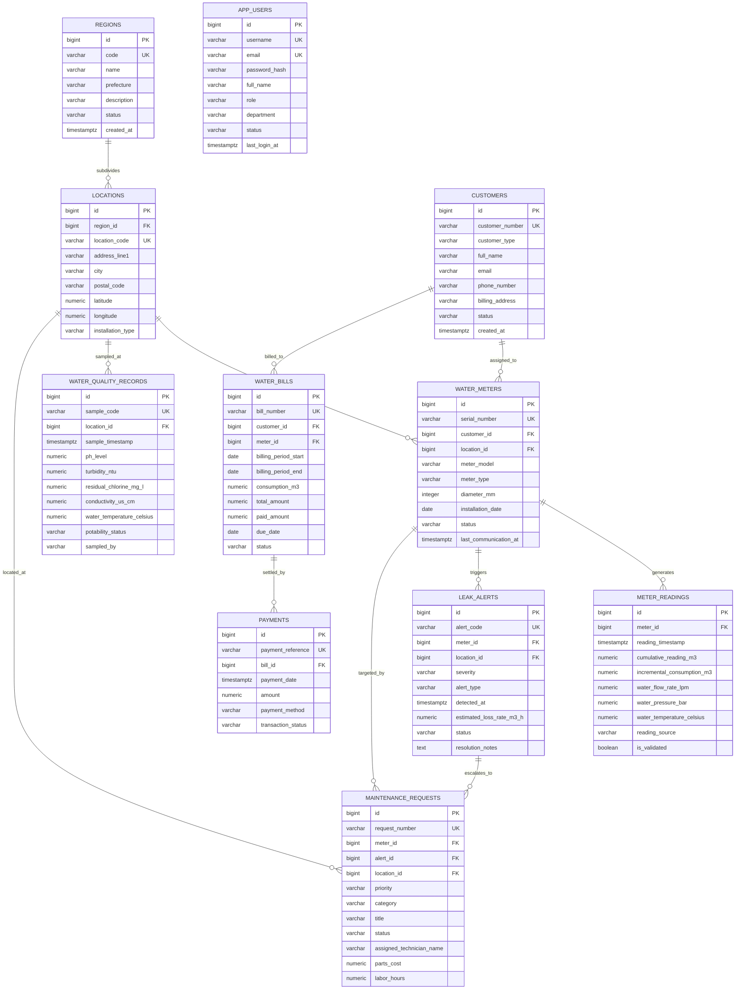

# Entity-Relationship Diagram (ERD)

```mermaid
erDiagram
    REGIONS ||--o{ LOCATIONS : "subdivides"
    LOCATIONS ||--o{ WATER_METERS : "hosts"
    LOCATIONS ||--o{ WATER_QUALITY_RECORDS : "sampled_at"
    LOCATIONS ||--o{ MAINTENANCE_REQUESTS : "located_at"

    CUSTOMERS ||--o{ WATER_METERS : "assigned_to"
    CUSTOMERS ||--o{ WATER_BILLS : "billed_to"

    WATER_METERS ||--o{ METER_READINGS : "generates"
    WATER_METERS ||--o{ LEAK_ALERTS : "triggers"
    WATER_METERS ||--o{ MAINTENANCE_REQUESTS : "targeted_by"

    WATER_BILLS ||--o{ PAYMENTS : "settled_by"

    LEAK_ALERTS ||--o{ MAINTENANCE_REQUESTS : "escalates_to"

    REGIONS {
        bigint id PK
        varchar code UK
        varchar name
        varchar prefecture
        varchar description
        varchar status
        timestamptz created_at
    }

    LOCATIONS {
        bigint id PK
        bigint region_id FK
        varchar location_code UK
        varchar address_line1
        varchar city
        varchar postal_code
        numeric latitude
        numeric longitude
        varchar installation_type
    }

    CUSTOMERS {
        bigint id PK
        varchar customer_number UK
        varchar customer_type
        varchar full_name
        varchar email
        varchar phone_number
        varchar billing_address
        varchar status
        timestamptz created_at
    }

    WATER_METERS {
        bigint id PK
        varchar serial_number UK
        bigint customer_id FK
        bigint location_id FK
        varchar meter_model
        varchar meter_type
        integer diameter_mm
        date installation_date
        varchar status
        timestamptz last_communication_at
    }

    METER_READINGS {
        bigint id PK
        bigint meter_id FK
        timestamptz reading_timestamp
        numeric cumulative_reading_m3
        numeric incremental_consumption_m3
        numeric water_flow_rate_lpm
        numeric water_pressure_bar
        numeric water_temperature_celsius
        varchar reading_source
        boolean is_validated
    }

    WATER_BILLS {
        bigint id PK
        varchar bill_number UK
        bigint customer_id FK
        bigint meter_id FK
        date billing_period_start
        date billing_period_end
        numeric consumption_m3
        numeric total_amount
        numeric paid_amount
        date due_date
        varchar status
    }

    PAYMENTS {
        bigint id PK
        varchar payment_reference UK
        bigint bill_id FK
        timestamptz payment_date
        numeric amount
        varchar payment_method
        varchar transaction_status
    }

    LEAK_ALERTS {
        bigint id PK
        varchar alert_code UK
        bigint meter_id FK
        bigint location_id FK
        varchar severity
        varchar alert_type
        timestamptz detected_at
        numeric estimated_loss_rate_m3_h
        varchar status
        text resolution_notes
    }

    WATER_QUALITY_RECORDS {
        bigint id PK
        varchar sample_code UK
        bigint location_id FK
        timestamptz sample_timestamp
        numeric ph_level
        numeric turbidity_ntu
        numeric residual_chlorine_mg_l
        numeric conductivity_us_cm
        numeric water_temperature_celsius
        varchar potability_status
        varchar sampled_by
    }

    MAINTENANCE_REQUESTS {
        bigint id PK
        varchar request_number UK
        bigint meter_id FK
        bigint alert_id FK
        bigint location_id FK
        varchar priority
        varchar category
        varchar title
        varchar status
        varchar assigned_technician_name
        numeric parts_cost
        numeric labor_hours
    }

    APP_USERS {
        bigint id PK
        varchar username UK
        varchar email UK
        varchar password_hash
        varchar full_name
        varchar role
        varchar department
        varchar status
        timestamptz last_login_at
    }
```
